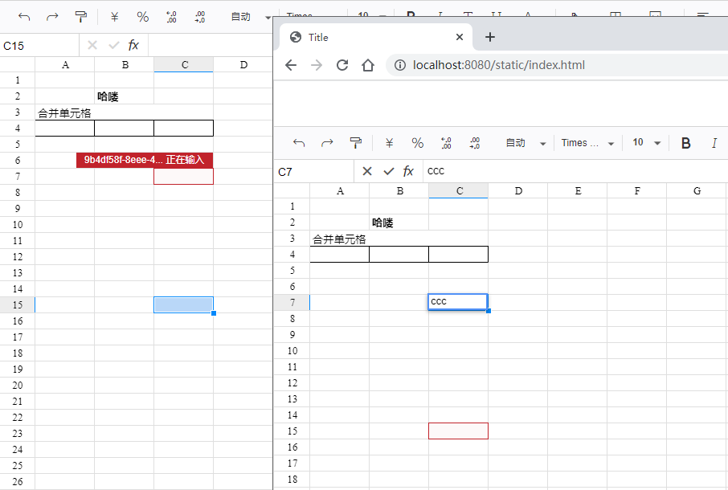

# luckysheet 在线协同编辑

本用例参考自 [luckysheet](https://github.com/czasg/pywss/tree/master/demo/luckysheet)

mongo（数据存储）版本参考：[luckysheet-mongo](https://github.com/czasg/pywss/tree/master/demo/luckysheet-mongo)

1、安装依赖：`pip install pywss>=0.1.1`

2、启动后端服务：`python app.py`

3、浏览器访问地址：http://localhost:8080/static/index.html

4、打开多个浏览器端口，即可完成在线编辑

